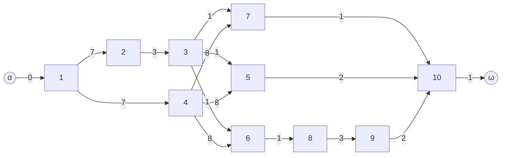
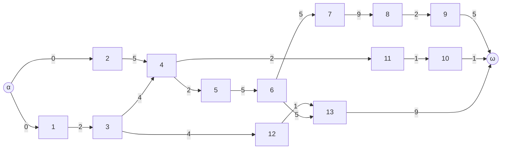

# Graph Theory — Scheduling Graph Analyser

A Python tool that reads a **constraint table** and performs a full scheduling-graph analysis:

- Builds the graph with a virtual source (α) and sink (ω)
- Displays the **adjacency / value matrix**
- Checks for **negative arcs**
- Detects **cycles** (Kahn's topological-sort algorithm)
- Computes the **rank** of every vertex
- Computes **earliest-start** and **latest-start** calendars
- Computes **margins** on every arc
- Finds all **critical paths**
- Saves a full **trace** to `traces/trace_<N>.txt`

---

## Project structure

```
.
├── main.py          # Entry point – interactive loop
├── functions.py     # All graph algorithms
├── table 1.txt      # Sample constraint tables (1–14)
│   ...
├── nc1.txt          # Example that contains a cycle
└── traces/          # Generated execution traces
```

---

## Input file format

Each line describes one task:

```
<task_id>  <duration>  [predecessor_1  predecessor_2  ...]
```

- `task_id` — integer, must be **contiguous starting from 1**
- `duration` — non-negative integer
- `predecessor_*` — optional list of task IDs that must finish before this task starts

**Example (`nc1.txt`):**

```
1  7
2  3  1
3  1  2
4  8  1
5  2  4  3
6  1  4  3
7  1  4  3
8  3  6
9  2  8
10 1  7  5  9
```

---

## How to run

```bash
python main.py
```

You will be prompted for the path to a constraint table:

```
Entrez le chemin du fichier de contraintes (.txt) ou 'q' pour quitter :
table 5.txt
```

The program prints each analysis step to the console **and** writes a full trace file.

---

## Graph examples

### Example 1 — `nc1.txt` (10 tasks, no cycle)

The program automatically adds:
- **α (vertex 0)** — virtual source connected (weight 0) to every task with no predecessor
- **ω (vertex 11)** — virtual sink connected from every task that has no successor (with its own duration as weight)



**Ranks** (topological levels):

| Vertex | 0 | 1 | 2 | 3 | 4 | 5 | 6 | 7 | 8 | 9 | 10 | 11 |
|--------|---|---|---|---|---|---|---|---|---|---|----|----|
| Rank   | 0 | 1 | 2 | 3 | 2 | 4 | 4 | 4 | 5 | 6 |  7 |  8 |

---

### Example 2 — `table 5.txt` (13 tasks, no cycle)

```
1  2
2  5
3  4  1
4  2  2  3
5  5  4
6  5  5
7  9  6
8  2  7
9  5  8
10 1  11
11 1  4
12 1  3
13 9  6  12
```

The resulting scheduling graph (15 vertices: α=0, tasks 1–13, ω=14):



**Earliest / Latest start dates and margins (arc level):**

| Arc        | E(u) | L(v) | Weight | Margin |
|------------|------|------|--------|--------|
| 0 → 1      | 0    | 0    | 0      | **0** ← critical |
| 0 → 2      | 0    | 1    | 0      | 1      |
| 1 → 3      | 0    | 2    | 2      | **0** ← critical |
| 2 → 4      | 0    | 6    | 5      | 1      |
| 3 → 4      | 2    | 6    | 4      | **0** ← critical |
| 4 → 5      | 6    | 8    | 2      | **0** ← critical |
| 5 → 6      | 8    | 13   | 5      | **0** ← critical |
| 6 → 7      | 13   | 18   | 5      | **0** ← critical |
| 7 → 8      | 18   | 27   | 9      | **0** ← critical |
| 8 → 9      | 27   | 29   | 2      | **0** ← critical |
| 9 → 14     | 29   | 34   | 5      | **0** ← critical |
| 4 → 11     | 6    | 32   | 2      | 24     |
| 11 → 10    | 8    | 33   | 1      | 24     |
| 10 → 14    | 9    | 34   | 1      | 24     |
| 3 → 12     | 2    | 24   | 4      | 18     |
| 12 → 13    | 6    | 25   | 1      | 18     |
| 6 → 13     | 13   | 25   | 5      | 7      |
| 13 → 14    | 18   | 34   | 9      | 7      |

**Critical path** (all arcs with margin = 0):

```
α(0) → 1 → 3 → 4 → 5 → 6 → 7 → 8 → 9 → ω(14)
```

Total project duration: **34**

---

## Algorithms

| Step | Algorithm | Complexity |
|------|-----------|------------|
| Negative arc check | Scan all matrix cells | O(V²) |
| Cycle detection | Kahn's algorithm (in-degree reduction) | O(V²) |
| Rank computation | BFS by in-degree layers | O(V²) |
| Earliest starts | Forward pass, sorted by rank | O(V²) |
| Latest starts | Backward pass, sorted by decreasing earliest date | O(V²) |
| Margin computation | L(v) − E(u) − w(u,v) for each arc | O(V²) |
| Critical paths | DFS restricted to zero-margin arcs | O(V + E) |

The adjacency matrix uses `None` for absent arcs and an integer weight for present ones.

---

## Trace output

After each run a file `traces/trace_<N>.txt` is created containing:

1. The full value matrix
2. Negative-arc check result
3. Step-by-step cycle detection log
4. Ranks per vertex
5. Earliest-start calendar
6. Latest-start calendar
7. Margins on every arc
8. All critical path(s)
